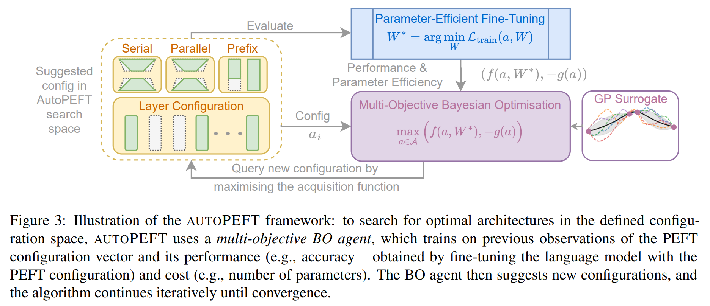

# Code for AutoPEFT: Automatic Configuration Search for Parameter-Efficient Fine-Tuning.

**Link to paper**:
[AutoPEFT: Automatic Configuration Search for Parameter-Efficient Fine-Tuning](https://arxiv.org/abs/2301.12132) (Accepted to TACL)
## Installation
1. Install pytorch, networkx and ConfigSpace  (version 1.12 as of Jul 2022). Also install botorch.
Please ensure python version < 3.10.
```
conda install pytorch torchvision torchaudio cudatoolkit=11.3 -c pytorch
```
Our code have been tested with both torch versions above and below 2.0.0.
```
conda install pytorch torchvision torchaudio pytorch-cuda=11.7 -c pytorch-nightly -c nvidia
conda install networkx
conda install statsmodels
pip install configspace
conda install botorch -c pytorch -c gpytorch -c conda-forge
```
2. Install adapter package by pulling from our modified adapter-transformers, which is a modified version of adatper-transformers=3.1.0

```
cd adapter-transformers-adapters3.1.0
pip install .
```
3. Also install the required packages. Make sure you cd to the ```adapter-transformers-adapters3.1.0``` folder and then
```
pip install -r examples/pytorch/text-classification/requirements.txt
```

4. To run locally, you can also install the model from Huggingface. Otherwise, just specify the bert-base-uncased in the model path to search on BERT.
```
cd ./adapterhub-nas
git lfs install
git clone https://huggingface.co/bert-base-uncased
```
5. Also install the required datasets from the following python scripts:
```
import datasets
data_list = ['mrpc', 'sst2', 'qnli', 'mnli', 'qqp', 'cola', 'rte', 'stsb']
for task in data_list:
    dataset = datasets.load_dataset('glue', task) #replace mrpc with other tasks
    dataset.save_to_disk('./datasets/glue/'+task)
```

## Do AutoPEFT Search
Use the ```run_one_replicate.py``` script as the launch point. 
```
$HOME_DIR/.conda/envs/autopeft/bin/python3 run_one_replicate \
    --overwrite \
    -t mrpc \
    -mi 200 \
    -an sappa \
    -ni 100 \
    -mp bert-base-uncased
```

## Citation
If you find our work to be useful, please cite:
```
@article{zhou-etal-2024-autopeft,
    title = "AutoPEFT: Automatic Configuration Search for Parameter-Efficient Fine-Tuning",
    author = "Zhou, Han  and
      Wan, Xingchen  and
      Vuli{\'c}, Ivan  and
      Korhonen, Anna",
    journal = "Transactions of the Association for Computational Linguistics",
    volume = "12",
    year = "2024",
    address = "Cambridge, MA",
    publisher = "MIT Press"
}
```
